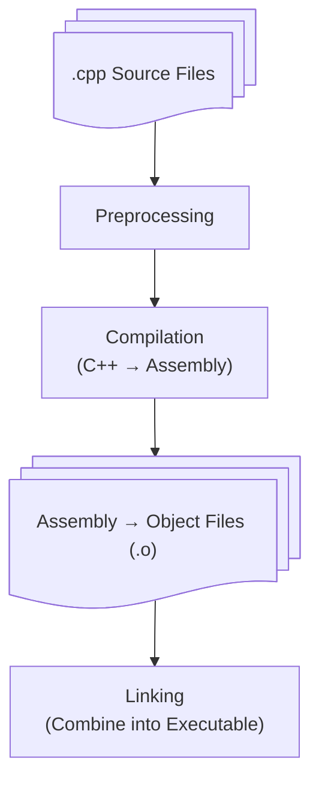
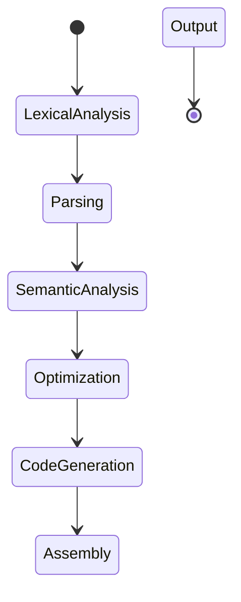
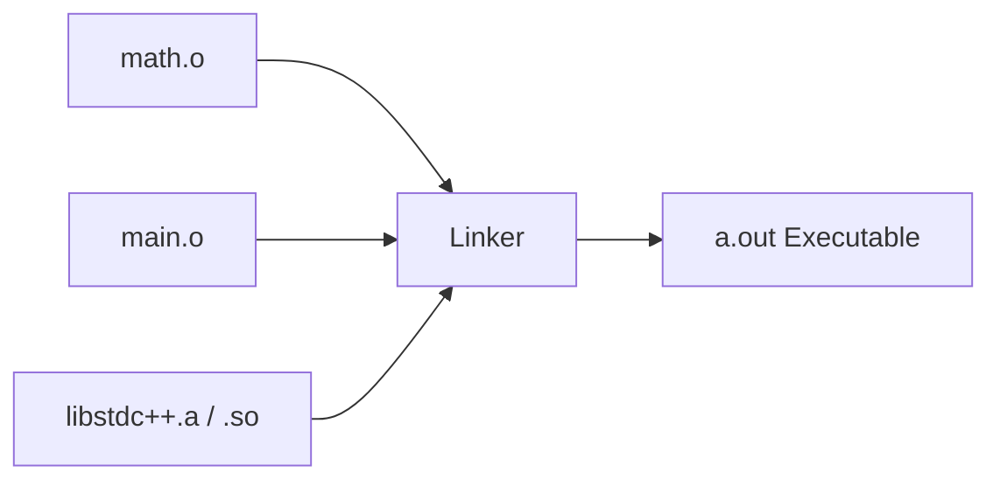
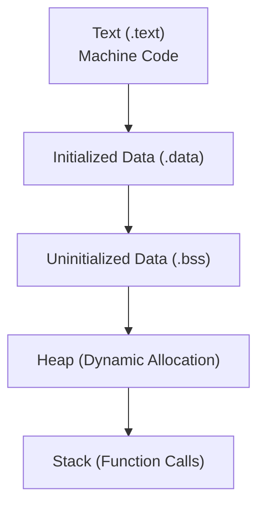
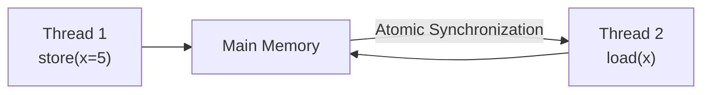
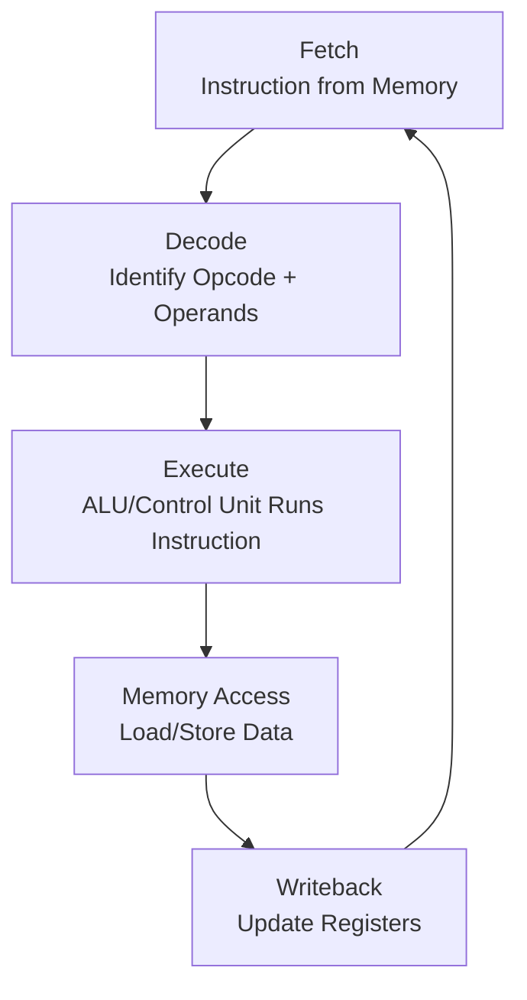
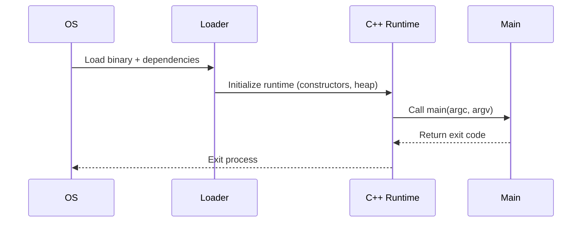
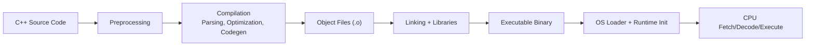

You’ve written a program, compiled it, and run it.

But what *actually* happens after you press **Enter**?
How does your source code turn into electric signals, memory reads, and CPU instructions?

Understanding this process, from **code to execution**, bridges the gap between software and hardware, and it’s one of the most empowering things you can learn as a developer.

::: tip
C++ is one of the few languages that lets you see *all the way down*, from your high-level logic to the individual instructions your CPU executes.
:::

::: info
This article breaks down what happens between writing a `.cpp` file and seeing your program run on the screen. We’ll follow step by step, from **compilation** to **linking**, **memory layout**, and **instruction execution**.
:::

---

## 1. From Source Code to Binary

When you build a C++ program, several distinct stages transform your human-readable source into a CPU-executable binary.



Each stage serves a purpose:

| Stage             | Tool             | Description                                                                                   |
| ----------------- | ---------------- | --------------------------------------------------------------------------------------------- |
| **Preprocessing** | `cpp`            | Handles `#include`, `#define`, conditional macros, and expands headers into the code.         |
| **Compilation**   | `g++`, `clang++` | Translates preprocessed C++ code into **assembly** instructions for a specific architecture.  |
| **Assembly**      | `as`             | Converts human-readable assembly into binary **machine code** stored in object files.         |
| **Linking**       | `ld`             | Combines all object files and libraries, resolving symbols into a complete executable binary. |

Each translation unit (`.cpp` file) is compiled separately into an object file. The linker later merges them all into one executable.

---

## 2. Preprocessing — Expanding the Code

The C++ preprocessor runs before the compiler sees any C++ syntax. It handles directives that start with `#`.

```shell :collapsed-lines=7
CPP(1)                                       GNU                                      CPP(1)

NAME
       cpp - The C Preprocessor

SYNOPSIS
       cpp [-Dmacro[=defn]...] [-Umacro]
           [-Idir...] [-iquotedir...]
           [-M|-MM] [-MG] [-MF filename]
           [-MP] [-MQ target...]
           [-MT target...]
           infile [[-o] outfile]

       Only the most useful options are given above; see below for a more complete list of
       preprocessor-specific options.  In addition, cpp accepts most gcc driver options,
       which are not listed here.  Refer to the GCC documentation for details.

DESCRIPTION
       The C preprocessor, often known as cpp, is a macro processor that is used
       automatically by the C compiler to transform your program before compilation.  It is
       called a macro processor because it allows you to define macros, which are brief
       abbreviations for longer constructs.
```

### Common Preprocessor Tasks

* Include header files: `#include <iostream>`
* Replace macros: `#define PI 3.14159`
* Conditional compilation: `#ifdef DEBUG`

Example:

```cpp
#include <iostream>
#define SQUARE(x) ((x) * (x))

int main()
{
#ifdef DEBUG
    std::cout << "Debug mode!" << std::endl;
#endif
    std::cout << SQUARE(3) << "\n";
}
```

After preprocessing, this becomes a single expanded source file:

- without `DEBUG` defined, the message is omitted.

```shell
$ cpp -xc++ -P main.cpp > main.pp.cpp
```

```cpp
int main()
{
    std::cout << ((3) * (3)) << "\n";
}
```

- with `DEBUG` defined, the debug message is included.

```shell
$ cpp -xc++ -P -DDEBUG main.cpp > main.pp.cpp
```

```cpp
int main()
{
    std::cout << "Debug mode!" << std::endl;
    std::cout << ((3) * (3)) << "\n";
}
```

::: important
All macros are resolved.
:::

::: warning
This is why large projects with heavy templates (like the STL) take longer to compile — the preprocessor must physically copy thousands of lines from headers.
:::

::: details `cpp` Command Options

`cpp` supports many options. Here are a few used above:
| Option | Meaning                                                      |
| :----- | :----------------------------------------------------------- |
| `-P`  | Suppress `#line` directives (cleaner output).                |
| `-DNAME[=VALUE]` | Define a macro `NAME` with optional `VALUE`.            |
| `-xc++` | Treat input files as C++ source files.                       |
:::


---

## 3. Compilation — Translating C++ to Assembly

The **compiler** turns C++ syntax into assembly code for your target CPU architecture.

For example:

```cpp
int add(int a, int b) { return a + b; }
```

might compile to:

```asm
_add:
    mov eax, edi     ; copy 'a' to eax
    add eax, esi     ; add 'b' to eax
    ret              ; return result in eax
```

### Compilation Stages Internally

The compilation phase itself has several sub-steps:



---

1. **Lexical Analysis**
::: info Description
The compiler’s **lexer (scanner)** reads the raw source code character by character and groups sequences into **tokens** — atomic units like keywords, identifiers, literals, and operators.
:::

::: important Purpose
Convert a stream of characters into a stream of meaningful symbols.
:::

::: tip Example

Expression:

```cpp
int sum = a + b * 2;
```

is broken into tokens:

```text
[int] [sum] [=] [a] [+] [b] [*] [2] [;]
```

:::

::: details

* Removes comments and redundant whitespace.
* Detects invalid tokens (e.g., `@` in C++).
* Classifies tokens as identifiers, keywords, literals, operators, punctuators, etc.
* Each token is usually represented by a structure like `{ type: TOKEN_IDENTIFIER, value: "sum", line: 1, column: 5 }`.
:::

---

2. **Parsing — *Syntax Analysis & AST Construction***

::: info Description
The **parser** consumes the tokens and checks whether they form a valid structure according to the language grammar (usually defined in BNF or EBNF form).
:::

::: important Purpose
Transform the linear token stream into a hierarchical **Abstract Syntax Tree (AST)** that represents the syntactic structure of the program.
:::

::: tip Example

Tokens:

```text
[int] [sum] [=] [a] [+] [b] [*] [2] [;]
```

are represented in an AST structure (simplified) as:

```yaml
Assignment
 ├── Type: int
 ├── Variable: sum
 └── Expression (+)
     ├── Left: a
     └── Right: (*)
         ├── Left: b
         └── Right: 2
```

:::

::: info Details

* Enforces grammar rules (e.g., expressions must be inside statements, statements inside blocks).
* Detects syntax errors like missing semicolons or mismatched parentheses.
* May perform error recovery to continue parsing after minor issues.

:::

---

3. **Semantic Analysis — *Meaning & Validation***

::: info Description
Once syntax is correct, the compiler verifies semantic correctness — the program “makes sense” according to language rules.
:::

::: important Purpose
Ensure types, declarations, and scopes are valid and consistent.
:::

::: note Checks performed:

| Check                               | What it does                                                             |
| :----------------------------------- | :------------------------------------------------------------------------ |
| Type checking                        | Validate expressions like `int` + `string` → invalid.                         |
| Scope resolution                     | Identify which variable/function a name refers to.                        |
| Declaration checks                   | Ensure symbols are declared before use.                                   |
| Const correctness & access control   | Detect `const` violations and private member access.                        |
| Template instantiation               | Generate specialized template code.                                       |
| Overload resolution                  | Pick the correct function overload.                                       |

:::

::: tip Example
```cpp
int x = "hello";   // ❌ invalid: assigning string to int
foo(3.14);         // ✅ finds foo(double) overload
```
:::

---

4. **Optimization — *Code Simplification & Transformation***

::: info Description
The compiler improves performance and/or reduces code size without changing behavior.
Optimizations happen at multiple stages — **AST-level**, **Intermediate Representation (IR)**, and **machine code**.
:::

::: note Common optimizations:

| Optimization          | What it does                                                                 |
| :-------------------- | :--------------------------------------------------------------------------- |
| Constant folding      | Evaluate constant expressions at compile time (e.g., `3 * 4` → `12`).            |
| Constant propagation  | Replace variables with known constant values.                                |
| Dead code elimination | Remove unreachable or unused code.                                           |
| Loop unrolling        | Duplicate loop body to reduce iteration overhead.                            |
| Inlining              | Replace small function calls with the function body.                         |
| Strength reduction    | Replace expensive ops with cheaper ones (e.g., `x * 2` → `x << 1`).              |

:::

::: tip Example

```cpp
for (int i = 0; i < 4; ++i) { sum += i; }
```

becomes:

```cpp
int sum = 0;
sum += 0;
sum += 1;
sum += 2;
sum += 3;
```

and then possibly folded into a constant result if `sum` is known.
:::

---

5. **Code Generation — *Intermediate Representation & Machine Mapping***

::: info Description
The **code generator** transforms the optimized AST or IR into target architecture instructions.
:::

::: important Purpose
Translate platform-independent logic into low-level operations.
:::

::: info Steps

1. Lower high-level constructs into **Intermediate Representation (IR)**, e.g., LLVM IR.
2. Perform **register allocation** — decide which variables go into CPU registers vs memory.
3. Select **machine instructions** matching the target architecture.
4. Apply target-specific optimizations (instruction scheduling, vectorization).

:::

::: tip Example (LLVM IR):

```llvm
%1 = add i32 %a, %b
%2 = mul i32 %1, 2
store i32 %2, i32* %sum
```

Resulting x86 assembly (simplified):

```asm
mov eax, [a]
add eax, [b]
shl eax, 1
mov [sum], eax
```

:::

---

6. **Assembly Output — *Final Translation***

::: info Description
The compiler writes out the final **assembly file** (.s) or directly produces **object code** (.o).
:::

::: important Purpose
Generate human-readable assembly for inspection or debugging.
:::


::: tip Example:

```asm
.section .text
.globl _main
_main:
    movl a(%rip), %eax
    addl b(%rip), %eax
    sall $1, %eax
    movl %eax, sum(%rip)
    ret
```

:::

::: info Then

* The assembler converts `.s` → `.o` (binary machine code).
* The linker combines `.o` files into a single executable, resolving external symbols.

:::

---

## 4. Linking — Combining Object Files

Large projects use multiple `.cpp` files that the linker must connect.

```cpp
// math.cpp
int add(int a, int b) { return a + b; }

// main.cpp
#include <iostream>
extern int add(int, int);
int main() { std::cout << add(2, 3); }
```

### Linking Steps

1. **Symbol Resolution** — matches function declarations (`extern`) with their definitions.
2. **Section Merging** — merges `.text` (code), `.data` (initialized globals), and `.bss` (zeroed data) sections.
3. **Relocation** — adjusts addresses so cross-file references point to correct memory locations.
4. **Static and Dynamic Linking** —

   * *Static:* libraries compiled into the binary (`libm.a`).
   * *Dynamic:* shared at runtime (`libstdc++.so`).



---

## 5. Program Memory Layout

When the OS loads your program, it maps sections into the process's virtual memory space.



| Segment   | Purpose                                      | Example                   |
| --------- | -------------------------------------------- | ------------------------- |
| **.text** | Compiled machine instructions (read-only).   | Compiled functions.  |
| **.data** | Global/static variables with initial values. | `int count = 5;`          |
| **.bss**  | Uninitialized global/static variables.       | `static int counter;`     |
| **Heap**  | Dynamic allocations using `new` or `malloc`. | `int* ptr = new int(10);` |
| **Stack** | Local variables and return addresses.        | `int local = 42;`         |

```cpp
int global = 42;        // .data
static int counter;     // .bss

int main()
{
    int local = 7;      // stack
    int* ptr = new int; // heap
}
```

The stack grows downward (toward lower addresses), while the heap grows upward. Collisions between them indicate memory corruption (e.g., stack overflow).


---

## 6. The C++ Memory Model

C++ defines a precise, formalized **memory model** — the rules that govern when reads and writes become visible to other threads and what behaviors are allowed or forbidden. Understanding it helps you write correct concurrent code and reason about performance.

### Core Concepts

* **Object lifetime:** when storage for an object is obtained and released.
* **Storage duration:** static, thread, automatic, or dynamic.
* **Happens-before and sequenced-before:** ordering guarantees within and across threads.
* **Data race:** two or more threads access the same memory location without synchronization. At least one access is a write → undefined behavior.

In a single-threaded program, operations are **sequenced-before** one another:

```cpp
int x = 1;      // (1)
x = x + 2;      // (2) sequenced after (1)
```

In multithreaded contexts, synchronization is required:

```cpp
#include <atomic>
#include <iostream>

std::atomic<int> x{0};

void thread1() { x.store(5); }
void thread2() { std::cout << x.load() << '\n'; }
```

Without `std::atomic` (or another synchronization mechanism), concurrent reads/writes to `x` would form a data race — undefined behavior that compilers may “optimize” into surprising results.



### Storage Duration and Lifetime

* **Static storage duration:** exists for the entire program (e.g., globals, `static` variables).
* **Thread storage duration:** exists for the lifetime of a thread (e.g., `thread_local`).
* **Automatic storage duration:** local variables; begin at block entry, end at block exit.
* **Dynamic storage duration:** obtained via `new`/`delete` or `malloc`/`free`.

```cpp
thread_local int tls_counter = 0; // each thread has its own instance
static int global_count = 0;      // shared across threads (synchronize accesses!)
```

### Atomics and Memory Ordering

Atomics provide both atomicity and ordering constraints. Common memory orders:

* `memory_order_relaxed` — atomicity only; no ordering guarantees.
* `memory_order_acquire` — a load that prevents subsequent operations from moving before it.
* `memory_order_release` — a store that prevents prior operations from moving after it.
* `memory_order_acq_rel` — combine acquire and release on read-modify-write.
* `memory_order_seq_cst` — the strongest; forms a single global total order of atomic ops.

Acquire–release pairs create a cross-thread happens-before relation:

```cpp
#include <atomic>
#include <string>

std::string data;
std::atomic<bool> ready{false};

void producer() {
    data = "payload";                 // 1: write data
    ready.store(true, std::memory_order_release); // 2: publish
}

void consumer() {
    while (!ready.load(std::memory_order_acquire)) { /* spin */ }
    // Happens-before ensures "data" is visible here
    use(data);
}
```

### Fences and Advanced Patterns

`std::atomic_thread_fence(order)` provides ordering without touching a specific atomic object. It’s useful in low-level lock-free algorithms and when interacting with device memory.

### Performance Notes: Caches and False Sharing

Modern CPUs maintain cache coherence. Two threads updating adjacent fields that reside in the same cache line can cause **false sharing**, leading to cache ping-pong and slowdowns. Use padding or `alignas` to separate frequently written counters:

```cpp
struct alignas(64) PaddedCounter { std::atomic<uint64_t> value{0}; };
```

::: tip
Keep shared writes rare. Prefer thread-local accumulation plus periodic aggregation.
:::

---

## 7. How Instructions Execute

Every compiled C++ program runs as a stream of **machine instructions** executed by the CPU in the **fetch–decode–execute** cycle.



::: tip Example: `int x = a + b;`

1. Fetch instruction `ADD` from `.text` memory.
2. Decode it: operands are registers holding `a` and `b`.
3. Execute: ALU performs addition.
4. Store result in `x`.
5. Move to next instruction via Program Counter.
:::

In reality, the CPU uses **pipelines**, **out-of-order execution**, and **branch prediction** to keep multiple instructions flowing simultaneously.

### Microarchitecture Essentials

* **Pipelines and superscalar width:** multiple instructions can be in flight and issued per cycle (instructions per cycle, IPC).
* **Out-of-order (OoO) execution:** instructions are reordered internally to hide latencies while preserving architectural correctness.
* **Branch prediction:** predicts control flow. A misprediction flushes the pipeline and costs cycles (the “mispredict penalty”).
* **Caches and memory hierarchy:** L1/L2/L3 caches and the TLB reduce average memory latency. Misses trigger longer access paths.

### Latency vs Throughput

* **Latency:** time to complete one instruction (e.g., a load that hits L1 may be ~4 cycles; an L3 miss can be hundreds of cycles).
* **Throughput:** steady-state rate (e.g., one add per cycle per port). Compilers schedule instructions to maximize throughput.

### SIMD and Vectorization

Modern CPUs expose SIMD (SSE/AVX/AVX-512). Compilers auto-vectorize simple loops. Libraries like `<execution>` can help:

```cpp
#include <algorithm>
#include <execution>
#include <vector>

void saxpy(std::vector<float>& y, const std::vector<float>& x, float a)
{
    std::transform(std::execution::par_unseq, x.begin(), x.end(), y.begin(), y.begin(),
                   [a](float xi, float yi) { return a * xi + yi; });
}
```

With optimization enabled, this often lowers to packed vector instructions.

### Memory Access Patterns

::: tip

* Prefer contiguous, sequential access (cache line–friendly).
* Avoid random access in hot loops; consider structure-of-arrays (SoA) layouts for better vectorization.
* Align frequently accessed data when beneficial.
:::

---

## 8. From Binary to Running Process

When you run a program, a complex chain of events occurs:

1. **Process Creation** — the OS allocates memory space.
2. **Loader Phase** — maps executable and shared libraries into memory.
3. **Runtime Setup** — initializes heap, global constructors, thread-local storage.
4. **Program Entry** — calls the `_start` symbol, which leads to `main()`.



### C++ Runtime Initialization

The runtime system:

* Runs all global and static constructors before `main()`.
* Initializes I/O subsystems.
* Prepares `std::thread`, `std::mutex`, and other runtime components.

After `main()` finishes, destructors for global/static objects are executed in reverse order of construction.

### ELF, the Dynamic Linker, and Relocations (Linux)

* **ELF format:** executables and shared libraries contain sections (e.g., `.text`, `.data`) and segments the loader maps with `mmap`.
* **Dynamic linker (`ld-linux`)** resolves imports at load time. The **PLT/GOT** indirection supports dynamic symbol binding and lazy resolution.
* **PIE and ASLR:** Position-Independent Executables enable Address Space Layout Randomization for security.
* **Relocations:** addresses in code/data are fixed up so references point to the correct runtime locations.

### CRT Startup and `main`

On Linux, `_start` (from the C runtime objects like `crt1.o`) sets up the process, initializes the runtime, and calls `__libc_start_main`, which eventually calls your `main(int argc, char** argv, char** envp)`.

### Thread-Local Storage (TLS)

TLS variables live in special segments (e.g., `.tdata`, `.tbss`) and are managed per thread by the runtime/loader.

### Security Hardening

* **NX/DEP:** non-executable stacks/heaps prevent code execution in data segments.
* **Stack canaries:** detect stack smashing.
* **RELRO:** read-only relocation sections after startup to prevent tampering.

### Signals, Exit, and Cleanup

The OS can deliver signals (e.g., `SIGSEGV`, `SIGINT`). Exit paths run `atexit` handlers, flush I/O, and invoke static destructors.

---

## 9. C++ Execution Pipeline Summary

From writing code to CPU cycles:



Errors at each stage have distinct characteristics:

* **Compilation errors:** syntax, type mismatches.
* **Linker errors:** missing symbols or duplicate definitions.
* **Runtime errors:** segmentation faults, memory corruption.

### Diagnose by Stage

* Compilation: enable warnings (`-Wall -Wextra -Wpedantic`) and treat as errors (`-Werror`) during CI.
* Linking: list symbols with `nm` and inspect ELF with `readelf -a`.
* Loading: check dependencies with `ldd` and run with `LD_DEBUG=libs` to trace library resolution.
* Runtime: attach `gdb`, record syscalls with `strace`, profile with `perf`, and analyze memory with Valgrind or sanitizers.

---

## 10. Why It Matters for a C++ Developer

C++ gives you unmatched control over how your program interacts with hardware. Understanding this pipeline lets you:

* Write **high-performance**, cache-aware code.
* Debug **build and runtime issues** methodically.
* Reduce **binary size and startup time**.
* Predict and fix **memory and threading problems**.
* Communicate effectively with compiler and system engineers.

::: important
When you know what happens under the hood, you gain both power and precision — turning abstract syntax into predictable machine behavior.
:::

### Practical Habits

- Prefer clear ownership: RAII, `unique_ptr` by default, `shared_ptr` only when needed.
- Make concurrency explicit: favor message passing or well-defined atomic protocols, document memory orders.
- Measure, don’t assume: use `perf`, `time`, and compiler reports (e.g., `-fopt-info` on GCC) to verify optimization.
- Keep hot data compact and contiguous, minimize sharing and contention.
- Enable hardening and diagnostics in dev builds: sanitizers, `-D_GLIBCXX_ASSERTIONS`.

### Handy Toolbelt

- Inspect codegen: `objdump -d`, `llvm-objdump -d`, Compiler Explorer (offline or online) to compare flags.
- Binary and symbol introspection: `readelf`, `nm`.
- Dependency and loading: `ldd`, `LD_DEBUG`.
- Behavior at runtime: `strace`, `ltrace`, `perf`, Valgrind.

These practices bridge the gap between intent and execution, making your C++ both faster and more reliable.