You’ve written a program, compiled it, and run it.

But what *actually* happens after you press **Enter**?
How does your source code turn into electric signals, memory reads, and CPU instructions?

Understanding this process, from **code to execution**, bridges the gap between software and hardware, and it’s one of the most empowering things you can learn as a developer.

::: tip
C++ is one of the few languages that lets you see *all the way down*, from your high-level logic to the individual instructions your CPU executes.
:::

::: info
This article breaks down what happens between writing a `.cpp` file and seeing your program run on screen. We’ll follow step by step, from **compilation** to **linking**, **memory layout**, and **instruction execution**.
:::

---

## 1. From Source Code to Binary

When you build a C++ program, several distinct stages transform your human-readable source into a CPU-executable binary.

```mermaid
flowchart TD
    A@{ shape: docs, label: ".cpp Source Files"} --> B[Preprocessing]
    B --> C["Compilation<br/>(C++ → Assembly)"]
    C --> D@{ shape: docs, label: "Assembly → Object Files (.o)"}
    D --> E["Linking<br/>(Combine into Executable)"]
```



Each stage serves a purpose:

| Stage             | Tool             | Description                                                                                   |
| ----------------- | ---------------- | --------------------------------------------------------------------------------------------- |
| **Preprocessing** | `cpp`            | Handles `#include`, `#define`, conditional macros, and expands headers into the code.         |
| **Compilation**   | `g++`, `clang++` | Translates preprocessed C++ code into **assembly** instructions for a specific architecture.  |
| **Assembly**      | `as`             | Converts human-readable assembly into binary **machine code** stored in object files.         |
| **Linking**       | `ld`             | Combines all object files and libraries, resolving symbols into a complete executable binary. |

Each translation unit (`.cpp` file) is compiled separately into an object file. The linker later merges them all into one executable.

---

## 2. Preprocessing — Expanding the Code

The C++ preprocessor runs before the compiler sees any C++ syntax. It handles directives that start with `#`.

```shell :collapsed-lines=7
CPP(1)                                       GNU                                      CPP(1)

NAME
       cpp - The C Preprocessor

SYNOPSIS
       cpp [-Dmacro[=defn]...] [-Umacro]
           [-Idir...] [-iquotedir...]
           [-M|-MM] [-MG] [-MF filename]
           [-MP] [-MQ target...]
           [-MT target...]
           infile [[-o] outfile]

       Only the most useful options are given above; see below for a more complete list of
       preprocessor-specific options.  In addition, cpp accepts most gcc driver options,
       which are not listed here.  Refer to the GCC documentation for details.

DESCRIPTION
       The C preprocessor, often known as cpp, is a macro processor that is used
       automatically by the C compiler to transform your program before compilation.  It is
       called a macro processor because it allows you to define macros, which are brief
       abbreviations for longer constructs.
```

### Common Preprocessor Tasks

* Include header files: `#include <iostream>`
* Replace macros: `#define PI 3.14159`
* Conditional compilation: `#ifdef DEBUG`

Example:

```cpp
#include <iostream>
#define SQUARE(x) ((x) * (x))

int main()
{
#ifdef DEBUG
    std::cout << "Debug mode!" << std::endl;
#endif
    std::cout << SQUARE(3) << "\n";
}
```

After preprocessing, this becomes a single expanded source file:

- without `DEBUG` defined, the message is omitted.

```shell
$ cpp -xc++ -P main.cpp > main.pp.cpp
```

```cpp
int main()
{
    std::cout << ((3) * (3)) << "\n";
}
```

- with `DEBUG` defined, the debug message is included.

```shell
$ cpp -xc++ -P -DDEBUG main.cpp > main.pp.cpp
```

```cpp
int main()
{
    std::cout << "Debug mode!" << std::endl;
    std::cout << ((3) * (3)) << "\n";
}
```

::: important
All macros are resolved.
:::

::: warning
This is why large projects with heavy templates (like the STL) take longer to compile — the preprocessor must physically copy thousands of lines from headers.
:::

::: details `cpp` Command Options

`cpp` supports many options. Here are a few used above:
| Option | Meaning                                                      |
| :----- | :----------------------------------------------------------- |
| `-P`  | Suppress `#line` directives (cleaner output).                |
| `-DNAME[=VALUE]` | Define a macro `NAME` with optional `VALUE`.            |
| `-xc++` | Treat input files as C++ source files.                       |
:::


---

## 3. Compilation — Translating C++ to Assembly

The **compiler** turns C++ syntax into assembly code for your target CPU architecture.

For example:

```cpp
int add(int a, int b) { return a + b; }
```

might compile to:

```asm
_add:
    mov eax, edi     ; copy 'a' to eax
    add eax, esi     ; add 'b' to eax
    ret              ; return result in eax
```

### Compilation Stages Internally

The compilation phase itself has several sub-steps:


---

1. **Lexical Analysis**
::: info Description
The compiler’s **lexer (scanner)** reads the raw source code character by character and groups sequences into **tokens** — atomic units like keywords, identifiers, literals, and operators.
:::

::: important Purpose
Convert a stream of characters into a stream of meaningful symbols.
:::

::: tip Example
Expression:
```cpp
int sum = a + b * 2;
```
is broken into tokens:
```
[int] [sum] [=] [a] [+] [b] [*] [2] [;]
```
:::

::: details

* Removes comments and redundant whitespace.
* Detects invalid tokens (e.g., `@` in C++).
* Classifies tokens as identifiers, keywords, literals, operators, punctuators, etc.
* Each token is usually represented by a structure like `{ type: TOKEN_IDENTIFIER, value: "sum", line: 1, column: 5 }`.
*
:::

---

2. **Parsing — *Syntax Analysis & AST Construction***

::: info Description
The **parser** consumes the tokens and checks whether they form a valid structure according to the language grammar (usually defined in BNF or EBNF form).
:::

::: important Purpose
Transform the linear token stream into a hierarchical **Abstract Syntax Tree (AST)** that represents the syntactic structure of the program.
:::

::: tip Example
Tokens:
```
[int] [sum] [=] [a] [+] [b] [*] [2] [;]
```
are represented in an AST structure (simplified) as:
```yaml
Assignment
 ├── Type: int
 ├── Variable: sum
 └── Expression (+)
      ├── Left: a
      └── Right: (*)
           ├── Left: b
           └── Right: 2
```
:::

::: info Details

* Enforces grammar rules (e.g., expressions must be inside statements, statements inside blocks).
* Detects syntax errors like missing semicolons or mismatched parentheses.
* May perform error recovery to continue parsing after minor issues.

:::

---

3. **Semantic Analysis — *Meaning & Validation***

::: info Description
Once syntax is correct, the compiler verifies semantic correctness — the program “makes sense” according to language rules.
:::

::: important Purpose
Ensure types, declarations, and scopes are valid and consistent.
:::

::: note Checks performed:

| Check                               | What it does                                                             |
| :----------------------------------- | :------------------------------------------------------------------------ |
| Type checking                        | Validate expressions like `int` + `string` → invalid.                         |
| Scope resolution                     | Identify which variable/function a name refers to.                        |
| Declaration checks                   | Ensure symbols are declared before use.                                   |
| Const correctness & access control   | Detect `const` violations and private member access.                        |
| Template instantiation               | Generate specialized template code.                                       |
| Overload resolution                  | Pick the correct function overload.                                       |

:::

::: tip Example
```cpp
int x = "hello";   // ❌ invalid: assigning string to int
foo(3.14);         // ✅ finds foo(double) overload
```
:::

---

4. **Optimization — *Code Simplification & Transformation***

::: info Description
The compiler improves performance and/or reduces code size without changing behavior.
Optimizations happen at multiple stages — **AST-level**, **Intermediate Representation (IR)**, and **machine code**.
:::

::: note Common optimizations:

| Optimization          | What it does                                                                 |
| :-------------------- | :--------------------------------------------------------------------------- |
| Constant folding      | Evaluate constant expressions at compile time (e.g., `3 * 4` → `12`).            |
| Constant propagation  | Replace variables with known constant values.                                |
| Dead code elimination | Remove unreachable or unused code.                                           |
| Loop unrolling        | Duplicate loop body to reduce iteration overhead.                            |
| Inlining              | Replace small function calls with the function body.                         |
| Strength reduction    | Replace expensive ops with cheaper ones (e.g., `x * 2` → `x << 1`).              |

:::

::: tip Example
```cpp
for (int i = 0; i < 4; ++i) { sum += i; }
```

becomes:

```cpp
int sum = 0;
sum += 0;
sum += 1;
sum += 2;
sum += 3;
```

and then possibly folded into a constant result if sum is known.
:::

---

5. **Code Generation — *Intermediate Representation & Machine Mapping***

::: info Description
The **code generator** transforms the optimized AST or IR into target architecture instructions.
:::

::: important Purpose
Translate platform-independent logic into low-level operations.
:::

::: info Steps

1. Lower high-level constructs into **Intermediate Representation (IR)**, e.g., LLVM IR.
2. Perform **register allocation** — decide which variables go into CPU registers vs memory.
3. Select **machine instructions** matching the target architecture.
4. Apply target-specific optimizations (instruction scheduling, vectorization).

:::

::: tip Example (LLVM IR):
```llvm
%1 = add i32 %a, %b
%2 = mul i32 %1, 2
store i32 %2, i32* %sum
```

Resulting x86 assembly (simplified):

```asm
mov eax, [a]
add eax, [b]
shl eax, 1
mov [sum], eax
```

:::

---

6. **Assembly Output — *Final Translation***

::: info Description
The compiler writes out the final **assembly file** (.s) or directly produces **object code** (.o).
:::

::: important Purpose
Generate human-readable assembly for inspection or debugging.
:::


::: tip Example:

```asm
.section .text
.globl _main
_main:
    movl a(%rip), %eax
    addl b(%rip), %eax
    sall $1, %eax
    movl %eax, sum(%rip)
    ret
```

:::

::: info Then

* The assembler converts `.s` → `.o` (binary machine code).
* The linker combines `.o` files into a single executable, resolving external symbols.

:::

---

## 4. Linking — Combining Object Files

Large projects use multiple `.cpp` files that the linker must connect.

```cpp
// math.cpp
int add(int a, int b) { return a + b; }

// main.cpp
#include <iostream>
extern int add(int, int);
int main() { std::cout << add(2, 3); }
```

### Linking Steps

1. **Symbol Resolution** — matches function declarations (`extern`) with their definitions.
2. **Section Merging** — merges `.text` (code), `.data` (initialized globals), and `.bss` (zeroed data) sections.
3. **Relocation** — adjusts addresses so cross-file references point to correct memory locations.
4. **Static and Dynamic Linking** —

   * *Static:* libraries compiled into the binary (`libm.a`).
   * *Dynamic:* shared at runtime (`libstdc++.so`).


---

## 5. Program Memory Layout

When the OS loads your program, it maps sections into the process's virtual memory space.


| Segment   | Purpose                                      | Example                   |
| --------- | -------------------------------------------- | ------------------------- |
| **.text** | Compiled machine instructions (read-only).   | Compiled functions.  |
| **.data** | Global/static variables with initial values. | `int count = 5;`          |
| **.bss**  | Uninitialized global/static variables.       | `static int counter;`     |
| **Heap**  | Dynamic allocations using `new` or `malloc`. | `int* ptr = new int(10);` |
| **Stack** | Local variables and return addresses.        | `int local = 42;`         |

```cpp
int global = 42;        // .data
static int counter;     // .bss

int main()
{
    int local = 7;      // stack
    int* ptr = new int; // heap
}
```

The stack grows downward (toward lower addresses), while the heap grows upward. Collisions between them indicate memory corruption (e.g., stack overflow).


---

## 6. The C++ Memory Model

C++ defines a strict **memory model** — a set of guarantees that describe how variables interact with memory, especially in concurrent contexts.

### Key Concepts

* **Object Lifetime:** when memory for an object is allocated and destroyed.
* **Storage Duration:** static, automatic, or dynamic.
* **Memory Order:** visibility of writes and reads across threads.

In a single-threaded program, operations are **sequenced-before** one another:

```cpp
int x = 1; // (1)
x = x + 2; // (2) sequenced after (1)
```

In multi-threaded contexts, synchronization is required:

```cpp
std::atomic<int> x{0};

void thread1() { x.store(5); }
void thread2() { std::cout << x.load(); }
```

Without `std::atomic`, both threads could read/write `x` concurrently, causing undefined behavior.

```mermaid
flowchart LR
    A[Thread 1<br/>store(x=5)] --> C[Main Memory]
    B[Thread 2<br/>load(x)] --> C
    C -->|Atomic Synchronization| B
```

The compiler and CPU are allowed to reorder instructions for optimization unless synchronization primitives (like atomics or locks) are used.

---

## 7. How Instructions Execute

Every compiled C++ program runs as a stream of **machine instructions** executed by the CPU in the **fetch–decode–execute** cycle.


### Example: `int x = a + b;`

1. Fetch instruction `ADD` from `.text` memory.
2. Decode it: operands are registers holding `a` and `b`.
3. Execute: ALU performs addition.
4. Store result in `x`.
5. Move to next instruction via Program Counter.

In reality, the CPU uses **pipelines**, **out-of-order execution**, and **branch prediction** to keep multiple instructions flowing simultaneously.

---

## 8. From Binary to Running Process

When you run a program, a complex chain of events occurs:

1. **Process Creation** — the OS allocates memory space.
2. **Loader Phase** — maps executable and shared libraries into memory.
3. **Runtime Setup** — initializes heap, global constructors, thread-local storage.
4. **Program Entry** — calls the `_start` symbol, which leads to `main()`.


### C++ Runtime Initialization

The runtime system:

* Runs all global and static constructors before `main()`.
* Initializes I/O subsystems.
* Prepares `std::thread`, `std::mutex`, and other runtime components.

After `main()` finishes, destructors for global/static objects are executed in reverse order of construction.

---

## 9. C++ Execution Pipeline Summary

From writing code to CPU cycles:

```mermaid
flowchart LR
    A[C++ Source Code] --> B[Preprocessing]
    B --> C[Compilation<br/>Parsing, Optimization, Codegen]
    C --> D[Object Files (.o)]
    D --> E[Linking + Libraries]
    E --> F[Executable Binary]
    F --> G[OS Loader + Runtime Init]
    G --> H[CPU Fetch/Decode/Execute]
```

Errors at each stage have distinct characteristics:

* **Compilation errors:** syntax, type mismatches.
* **Linker errors:** missing symbols or duplicate definitions.
* **Runtime errors:** segmentation faults, memory corruption.

---

## 10. Why It Matters for a C++ Developer

C++ gives you unmatched control over how your program interacts with hardware. Understanding this pipeline lets you:

* Write **high-performance**, cache-aware code.
* Debug **build and runtime issues** methodically.
* Reduce **binary size and startup time**.
* Predict and fix **memory and threading problems**.
* Communicate effectively with compiler and system engineers.

When you know what happens under the hood, you gain both power and precision — turning abstract syntax into predictable machine behavior.

---

## 🧭 Coming Next

**Next Post:** [Memory Hierarchy and Cache — Why Some C++ Code Runs Faster](./memory-hierarchy-and-cache.md)

We’ll explore how CPUs cache data and why understanding locality is critical to writing performant C++ code.

---

> “To be a great C++ programmer, you must know what your code *really becomes* once compiled.”
