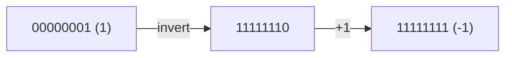
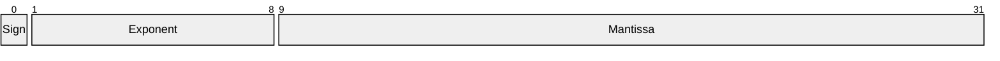
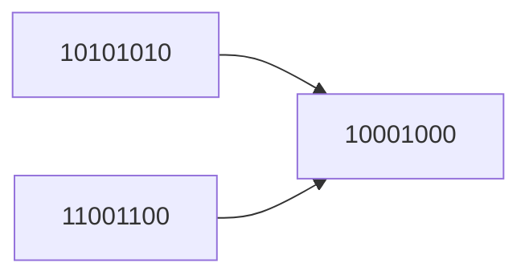

::: info
Everything in your C++ program, from integers to text, is represented as bits: 1s and 0s.
:::

This post explains how fundamental C++ types are stored and interpreted in memory, how endianness affects them, and why understanding representation matters when debugging, optimizing, or working close to the hardware.

::: details What you'll learn in 10 minutes

- [x] Bits, bytes, nibbles, and words — and why a byte isn’t always 8 bits[^charbit]
- [x] How signed/unsigned integers are represented (two’s complement) and where undefined behavior lurks
- [x] How endianness impacts binary I/O, networking, and file formats — plus modern C++ helpers
- [x] How floating point really stores numbers and why `0.1 + 0.2 ≠ 0.3`
- [x] How text is bytes with meaning: ASCII, UTF-8/16/32, and practical tips
- [x] Bitwise operations and modern **bit** tools for fast, clear code

:::

---

## 1. What is a bit and a byte?

A **bit** is the smallest unit of information — it can be either 0 or 1.
A **byte** is the smallest addressable unit of memory and typically contains 8 bits in modern architectures.


A byte can represent `2⁸ = 256` possible values, from `00000000` (0) to `11111111` (255).

In C++, a `char` always occupies **1 byte**, but that does not necessarily mean 8 bits — the standard only guarantees that `sizeof(char) == 1` and that the number of bits in a byte is `CHAR_BIT` from `<climits>`[^charbit].

::: details Terminology deep dive

- **A ==nibble==** is 4 bits (half a byte).
- **A ==word==** is the native register size (commonly 32 or 64 bits), and terms like “double word” (DWORD) and “quad word” (QWORD) follow.
- Alignment and padding mean that structs may take more space than the sum of their fields — this matters for binary serialization.
:::

---

## 2. Integer representation

C++ defines several integer types, **signed** and **unsigned**:

| Type                   | Size (typical) | Range (approximate)             |
| ---------------------- | -------------- | ------------------------------- |
| `int8_t` / `uint8_t`   | 1 byte         | -128 to 127 / 0 to 255          |
| `int16_t` / `uint16_t` | 2 bytes        | -32,768 to 32,767 / 0 to 65,535 |
| `int32_t` / `uint32_t` | 4 bytes        | -2³¹ to 2³¹-1 / 0 to 2³²-1      |
| `int64_t` / `uint64_t` | 8 bytes        | -2⁶³ to 2⁶⁴-1                   |

These are fixed-width integer types defined in `<cstdint>`.

::: tip Prefer fixed-width types for I/O and protocols
Use `std::int32_t`/`std::uint32_t` when reading/writing binary data, hashing, or implementing protocols. Built-in types like `int` and `long` vary by platform and ABI.
:::

### Two’s complement representation

Most modern CPUs use **two’s complement** to represent signed integers.

Example for an 8-bit signed integer:

| Decimal | Binary   | Explanation                             |
| ------- | -------- | --------------------------------------- |
| 0       | 00000000 | all bits 0                              |
| 1       | 00000001 | least significant bit set               |
| -1      | 11111111 | invert (00000001 → 11111110) then add 1 |
| -2      | 11111110 | likewise                                |



The most significant bit (MSB) is the **sign bit** — `0` for non-negative, `1` for negative.

### Example in C++

```cpp
#include <bitset>
#include <cstdint>
#include <iomanip>
#include <iostream>

template <typename T>
void print(T value)
{
    // Align the numeric value in a fixed-width column, then show the bit pattern
    constexpr int Bits = static_cast<int>(sizeof(T) * 8);
    std::cout << std::right << std::setw(8)
              << +value << "  =>  " << std::bitset<Bits>(value)
              << '\n';
}

int main()
{
    print(static_cast<int8_t>(1));
    print(static_cast<uint8_t>(2));
    print(static_cast<uint8_t>(4));
    print(static_cast<uint8_t>(5));
    print(static_cast<int8_t>(-5));
    print(static_cast<uint8_t>(250));
    print(static_cast<int16_t>(-12345));

    return 0;
}
```

Output:

```text
       1  =>  00000001
       2  =>  00000010
       4  =>  00000100
       5  =>  00000101
      -5  =>  11111011
     250  =>  11111010
  -12345  =>  1100111111000111
```

::: tip Unary operator `+` explained
You’re seeing the unary plus (`+`) operator. In this context, `+value` forces integral promotion so small integer types (like `int8_t`/`uint8_t`, which are typically aliases of **signed**/**unsigned** `char`) are treated as integers instead of characters when streamed to `std::cout`.

Why it’s used here:

- Without `+`, printing `int8_t`/`uint8_t` uses the char overload of `operator<<` and you’d get a character (e.g., `ñ`) instead of the numeric value.
- With `+value`, the value is promoted to `int`, so `std::cout` picks the integer overload and prints the number (e.g., 250).

Quick examples:

```cpp
char c      = 'A';  std::cout   << c;   // prints A
char c      = 'A';  std::cout   << +c;  // prints 65
int8_t s    = -5;   std::cout   << s;   // prints a strange char (implementation-defined)
int8_t s    = -5;   std::cout   << +s;  // prints -5
uint8_t u   = 250;  std::cout   << u;   // prints a char
uint8_t u   = 250;  std::cout   << +u;  // prints 250
```

Notes:

- Unary `+` doesn’t change the value. For built-in arithmetic types it’s essentially a no-op except for triggering integral promotions (`char`/`unsigned` `char`/`signed` `char`/`short`/`bool` → `int` or `unsigned int`).
- An explicit alternative is `std::cout << static_cast<int>(value);` which some prefer for clarity.

:::

---

## 3. Endianness — byte order

Endianness determines how multibyte values are stored in memory.

- **Little-endian** — least significant byte stored first (Intel, ARM64).
- **Big-endian** — most significant byte stored first (network protocols, some embedded CPUs).

For instance, for value `0xAABBCCDD` (32-bit integer):


Example:

```cpp
#include <bit>
#include <cstdint>
#include <iostream>

int main()
{
    if (std::endian::native == std::endian::little)
    {
        std::cout << "Little-endian\n";
    }
    else
    {
        std::cout << "Big-endian\n";
    }

    return 0;
}
```

::: details Inspecting bytes of an integer (C++20)

```cpp
#include <cstddef>
#include <cstdint>
#include <iomanip>
#include <iostream>
#include <span>

int main()
{
    std::uint32_t v = 0xAABBCCDDu;

    auto bytes = std::as_bytes(std::span{&v, 1u});  // view v as a span of bytes

    std::cout << std::hex << std::setfill('0');
    for (std::byte b : bytes)
    {
        std::cout << std::setw(2) << std::to_integer<unsigned>(b) << ' ';
    }
    std::cout << '\n';

    return 0;
}
```

Output:

```
dd cc bb aa
```

- `std::as_bytes` clearly says “I’m viewing this as raw bytes”.
- `std::span{&v, 1u}` makes it explicit that you’re treating `v` as a one-element array.
- `std::byte` is a dedicated “byte” type instead of abusing `unsigned char` and is an enum-like type meant to represent a raw byte, not a number. To get an actual integer out of it, you use:

```cpp
std::to_integer<T>(std::byte)
```

which returns a value of type T.


Modern C++23 adds `std::byteswap` (in `<bit>`) to flip endian safely:

::: code-tabs#cpp
@tab C++23

```cpp
#include <bit>
#include <cstdint>

std::uint32_t be = 0xAABBCCDDu;
std::uint32_t le = std::byteswap(be); // AA BB CC DD ↔ DD CC BB AA
```

@tab Pre-C++23

```cpp
#include <cstdint>

constexpr std::uint32_t byteswap(std::uint32_t x) noexcept
{
    return ((x & 0x000000FFu) << 24) |
           ((x & 0x0000FF00u) << 8)  |
           ((x & 0x00FF0000u) >> 8)  |
           ((x & 0xFF000000u) >> 24);
}
```
:::

:::

::: warning Network protocols are big-endian
When writing networking code (sockets), always convert host ↔ network byte order. On POSIX use `htons/htonl` and friends, or use `std::byteswap` with care when rolling your own.
:::

::: details Real‑world example: framed messages with big‑endian headers

Suppose you define a simple framing protocol for a TCP stream: a 6‑byte header followed by a payload.

- Header layout (on the wire, big‑endian):
  - 4 bytes: payload length in bytes (`uint32`)
  - 2 bytes: message type (`uint16`)

The examples below show how to encode/decode the header and perform robust, full reads/writes.

::: code-tabs#net-endian
@tab POSIX (`htonl`/`htons`)

```cpp
#include <array>
#include <cstdint>
#include <cstring>
#include <span>
#include <vector>
#include <system_error>
#include <cerrno>
#include <unistd.h>     // read, write
#include <arpa/inet.h>  // htonl, htons, ntohl, ntohs

// Blocking, robust write: retries on EINTR, throws on error
static void write_all(int fd, const void* buf, std::size_t n)
{
    const char* p = static_cast<const char*>(buf);
    while (n > 0)
    {
        ssize_t w = ::write(fd, p, n);
        if (w < 0)
        {
            if (errno == EINTR) continue;
            throw std::system_error(errno, std::generic_category(), "write");
        }
        p += static_cast<std::size_t>(w);
        n -= static_cast<std::size_t>(w);
    }
}

// Blocking, robust read: reads exactly n bytes or throws on error/EOF
static void read_all(int fd, void* buf, std::size_t n)
{
    char* p = static_cast<char*>(buf);
    while (n > 0)
    {
        ssize_t r = ::read(fd, p, n);
        if (r == 0) throw std::system_error(0, std::generic_category(), "eof");
        if (r < 0)
        {
            if (errno == EINTR) continue;
            throw std::system_error(errno, std::generic_category(), "read");
        }
        p += static_cast<std::size_t>(r);
        n -= static_cast<std::size_t>(r);
    }
}

// Send a frame: [len:4][type:2][payload:len]
static void send_frame(int fd, std::uint16_t type, std::span<const std::byte> payload)
{
    std::array<std::byte, 6> hdr{};

    std::uint32_t len_be  = htonl(static_cast<std::uint32_t>(payload.size()));
    std::uint16_t type_be = htons(type);

    std::memcpy(hdr.data() + 0, &len_be,  sizeof len_be);
    std::memcpy(hdr.data() + 4, &type_be, sizeof type_be);

    write_all(fd, hdr.data(), hdr.size());
    if (!payload.empty()) write_all(fd, payload.data(), payload.size());
}

// Receive a frame, returning the payload; outType set to message type
static std::vector<std::byte> recv_frame(int fd, std::uint16_t& outType)
{
    std::array<std::byte, 6> hdr{};
    read_all(fd, hdr.data(), hdr.size());

    std::uint32_t len_be{};  std::uint16_t type_be{};
    std::memcpy(&len_be,  hdr.data() + 0, sizeof len_be);
    std::memcpy(&type_be, hdr.data() + 4, sizeof type_be);

    std::uint32_t len = ntohl(len_be);
    outType = ntohs(type_be);

    std::vector<std::byte> payload(len);
    if (len) read_all(fd, payload.data(), payload.size());
    return payload;
}
```

Notes:

- On Windows, use Winsock’s `htonl/htons` (same names) and `send/recv` APIs; the packing logic is identical.
- The header is assembled in a byte buffer to avoid struct padding/alignment pitfalls.
- This version assumes blocking sockets; for non‑blocking sockets integrate with `poll/epoll/kqueue` and handle `EAGAIN`/`EWOULDBLOCK`.

@tab Portable C++23 (`<bit>`, endian + byteswap)

```cpp
#include <bit>
#include <array>
#include <cstdint>
#include <cstring>

constexpr std::uint16_t to_be16(std::uint16_t v) noexcept
{
    if constexpr (std::endian::native == std::endian::little) return std::byteswap(v);
    else return v;
}

constexpr std::uint32_t to_be32(std::uint32_t v) noexcept
{
    if constexpr (std::endian::native == std::endian::little) return std::byteswap(v);
    else return v;
}

constexpr std::uint16_t from_be16(std::uint16_t v) noexcept { return to_be16(v); }
constexpr std::uint32_t from_be32(std::uint32_t v) noexcept { return to_be32(v); }

// Pack header without platform-specific headers
inline std::array<std::byte, 6> pack_header(std::uint32_t len, std::uint16_t type)
{
    std::array<std::byte, 6> hdr{};
    auto len_be  = to_be32(len);
    auto type_be = to_be16(type);
    std::memcpy(hdr.data() + 0, &len_be,  sizeof len_be);
    std::memcpy(hdr.data() + 4, &type_be, sizeof type_be);
    return hdr;
}

inline void unpack_header(const std::array<std::byte, 6>& hdr, std::uint32_t& len, std::uint16_t& type)
{
    std::uint32_t len_be{}; std::uint16_t type_be{};
    std::memcpy(&len_be,  hdr.data() + 0, sizeof len_be);
    std::memcpy(&type_be, hdr.data() + 4, sizeof type_be);
    len  = from_be32(len_be);
    type = from_be16(type_be);
}
```

This tab focuses on the conversion helpers using standard C++ (no OS headers). Use them together with your platform’s I/O API (e.g., `send/recv`, file streams, or `asio`).

:::

:::

---

## 4. Floating-point representation

Floating-point numbers follow the **IEEE‑754** standard. A `float` (32-bit) consists of:

| Field               | Bits | Description                  |
| ------------------- | ---- | ---------------------------- |
| Sign                | 1    | 0 = positive, 1 = negative   |
| Exponent            | 8    | Biased exponent (bias = 127) |
| Fraction (mantissa) | 23   | Represents precision         |



A `double` uses `1 + 11 + 52 = 64` bits.

Mathematically, a finite *IEEE-754* value is encoded as:

$$
    ext{value} = (-1)^{\text{sign}} \times (1.\text{fraction}) \times 2^{\text{exponent} - \text{bias}}
$$

### Example: `float f = 12.75f`

```text
Sign:      0
Exponent:  10000010  (bias 127 → exponent 3)
Mantissa:  10011000000000000000000
Binary:    0 10000010 10011000000000000000000
Hex:       0x41480000
```

You can reinterpret bits in C++ using a union or `std::bit_cast` (C++20):

```cpp
#include <bit>
#include <bitset>
#include <iostream>

int main()
{
    float f = 12.75f;
    auto bits = std::bit_cast<uint32_t>(f);
    std::cout << std::bitset<32>(bits) << "\n";
}
```

Output:

```text
01000001010011000000000000000000
```

::: warning Equality with floats is tricky
Due to binary fractions, many decimals (like 0.1) cannot be represented exactly. Prefer comparisons with a tolerance.

```cpp
#include <cmath>
#include <iostream>

int main()
{
    double a = 0.1, b = 0.2, c = 0.3;
    std::cout << std::boolalpha << (a + b == c) << "\n"; // typically false
    auto eq = std::fabs((a + b) - c) < 1e-12;             // true
    std::cout << eq << "\n";
}
```

### Floating-point tools and libraries — practical options

Floating-point requirements vary a lot by domain: graphics, scientific computing, finance, embedded systems. Choose the tool that matches your correctness, performance, and portability constraints.

#### A. Standard library techniques (good first step)

- Tolerance-based comparisons

```cpp
#include <cmath>
#include <limits>

bool almost_equal(double a, double b, double rel_eps = 1e-12, double abs_eps = 1e-15)
{
    double diff = std::fabs(a - b);
    if (diff <= abs_eps) { return true; }
    return diff <= rel_eps * std::max(std::fabs(a), std::fabs(b));
}
```

- Use `std::numeric_limits<T>::epsilon()` for machine epsilon and careful tolerances. For example, for `double`, `epsilon()` is the difference between 1 and the least value greater than 1.

- Use `std::nextafter` for ULP-aware tests. Example: check whether two doubles differ by at most N representable steps (ULPs):

```cpp
#include <cmath>

bool within_ulps(double a, double b, unsigned long max_ulps = 4)
{
    if (std::isnan(a) || std::isnan(b)) { return false; }
    if (std::signbit(a) != std::signbit(b)) { return a == b; } // handle +/-0

    auto ai = reinterpret_cast<const unsigned long&>(a);
    auto bi = reinterpret_cast<const unsigned long&>(b);
    auto diff = (ai > bi) ? ai - bi : bi - ai;

    return diff <= max_ulps;
}
```

Note: `reinterpret_cast` counting like above relies on portability details. Prefer canonical ULP helpers in libraries where available.

#### B. Higher precision / decimal correctness

When you need more precision or decimal-exact semantics (for finance), consider these libraries:

- Boost.Multiprecision — `cpp_dec_float` and `cpp_bin_float`
    - Arbitrary precision decimal or binary floating types implemented in header-only Boost.
    - Replace `double` when you need many digits or decimal arithmetic that avoids binary rounding surprises.

```cpp
#include <boost/multiprecision/cpp_dec_float.hpp>
#include <iostream>

using dec50 = boost::multiprecision::cpp_dec_float_50;

int main()
{
    dec50 a = "0.1";
    dec50 b = "0.2";
    dec50 c = a + b;
    std::cout << std::setprecision(20) << c << "\n"; // prints exactly 0.3
}
```

- MPFR / GMP bindings
    - Multi-precision libraries (C and C++) with bindings for correct rounding, high performance for many digits.
    - Heavy numerical computation with strict reproducibility and IEEE-like rounding controls.

#### C. Practical numeric helpers and patterns

- Use `long double` when small extra range/precision helps and platform supports it efficiently (but be aware of platform differences — on x86_64 `long double` may be 80-bit, on others it might be 128-bit or same as double).
- Use `std::fma` to reduce rounding when computing expressions where intermediate rounding matters (e.g., polynomial evaluation).
- Use `std::frexp` / `std::ldexp` for scaling by powers of two without losing binary precision.
- Use `std::fenv` (C `<fenv.h>`) to inspect/set rounding modes on platforms that support it — useful for portable numerical tests.

#### D. Example: stable summation (Kahan)

Floating-point addition is not associative. For large sums prefer compensated summation:

```cpp
double kahan_sum(const std::vector<double>& v)
{
    double sum = 0.0;
    double c = 0.0; // compensation

    for (double x : v)
    {
        double y = x - c;
        double t = sum + y;
        c = (t - sum) - y;
        sum = t;
    }
    return sum;
}
```

This simple algorithm dramatically reduces error in many practical workloads (finance, numerics) with negligible complexity cost.

:::

::: details Special values

- **Infinities**: divide by zero with nonzero numerator yields ±∞.
- **NaNs**: results of invalid operations (e.g., `0.0/0.0`, `sqrt(-1.0)`). All comparisons with NaN are false except `std::isnan`.
- **Subnormals**: represent numbers very close to zero at reduced precision.

:::

---

## 5. Character and string representation

Characters are just small integers interpreted as symbols via an **encoding**.

### ASCII Table Snapshot

| Char | Decimal | Binary   |
| ---- | ------- | -------- |
| 'A'  | 65      | 01000001 |
| 'a'  | 97      | 01100001 |
| '0'  | 48      | 00110000 |
| ' '  | 32      | 00100000 |

C++ `char` values map to **ASCII** (or UTF‑8) by default on most systems.

### Example

```cpp
#include <iostream>
#include <bitset>

int main()
{
    char c = 'A';
    std::cout << c << " => " << (int)c << " => " << std::bitset<8>(c) << "\n";
}
```

Output:

```text
A => 65 => 01000001
```

---

## 6. Unicode and UTF encodings

C++ supports multiple character types:

| Type       | Encoding                 | Typical use                              |
| ---------- | ------------------------ | ---------------------------------------- |
| `char`     | UTF-8 or locale-specific | Narrow strings (often UTF‑8 today)       |
| `wchar_t`  | UTF-16 or UTF-32         | Wide characters (legacy; platform-dependent) |
| `char8_t`  | UTF-8                    | C++20, explicit 8‑bit text               |
| `char16_t` | UTF-16                   | UTF‑16 literals (e.g., `u"text"`)        |
| `char32_t` | UTF-32                   | Unicode code points (`U+XXXX`)           |

Example:

```cpp
#include <iostream>
#include <string>

int main()
{
    char8_t  c8  = u8'Ω';
    char16_t c16 = u'Ω';
    char32_t c32 = U'Ω';
    std::cout << "UTF-8 bytes:  " << sizeof(c8)  << "\n";
    std::cout << "UTF-16 bytes: " << sizeof(c16) << "\n";
    std::cout << "UTF-32 bytes: " << sizeof(c32) << "\n";
}
```

Output:

```text
UTF-8 bytes:  1
UTF-16 bytes: 2
UTF-32 bytes: 4
```

::: warning Don’t assume `char` means *UTF‑8*
`char` is a single byte, but whether it holds *UTF‑8* is a build/runtime choice. When you need explicit *UTF‑8*, prefer `char8_t` and `std::u8string` (C++20).
:::

---

## 7. Bitwise operations — the bridge between logic and data

C++ gives you full control over bits:

```cpp
std::uint8_t x = 0b1010'1010; // digit separators improve readability
std::uint8_t y = 0b1100'1100;

auto a = std::uint8_t(x & y);  // AND  => 1000'1000
auto o = std::uint8_t(x | y);  // OR   => 1110'1110
auto e = std::uint8_t(x ^ y);  // XOR  => 0110'0110
auto n = std::uint8_t(~x);     // NOT  => 0101'0101
auto s = std::uint8_t(x << 2); // SHL  => 1010'1000 (low bits become 0)
```

### Visualizing Bitwise AND



::: details Bit flags in practice
Use bit masks to represent sets of boolean options compactly.

```cpp
enum class Permission : std::uint8_t { Read=1<<0, Write=1<<1, Exec=1<<2 };

inline Permission operator|(Permission a, Permission b)
{
    return static_cast<Permission>(std::to_underlying(a) | std::to_underlying(b));
}

inline bool has(Permission mask, Permission p)
{
    return (std::to_underlying(mask) & std::to_underlying(p)) != 0;
}

Permission p = Permission::Read | Permission::Write;
bool canWrite = has(p, Permission::Write);
```
:::

::: warning Common pitfalls

- Shifting by a count ≥ bit-width is undefined behavior.
- Signed overflow is undefined behavior; unsigned overflow wraps by definition.
- `char` signedness is implementation-defined; prefer `<cstdint>` types when bit-twiddling.

:::

### Modern C++ bit utilities

`<bit>` (C++20/23) provides fast, readable helpers:

```cpp
#include <bit>
#include <cstdint>

bool one = std::has_single_bit(0x8000u);      // true
auto bw   = std::bit_width(1024u);             // 11
auto ceil = std::bit_ceil(1000u);              // 1024
auto floor= std::bit_floor(1000u);             // 512
auto r    = std::rotl(0b0001u, 2);             // 0b0100
auto sbs  = std::byteswap(0xAABBCCDDu);        // 0xDDCCBBAA (C++23)
```


---

## 9. Standard library helpers referenced in this post

Below are short explanations and small examples for the `std` symbols used throughout this article. If a symbol was used above but not explained in detail, you'll find it here.

- `std::bitset` (header: `<bitset>`)
    - Represents a fixed-size sequence of bits with convenient printing and bitwise APIs.
    - Visualize bits, do bitwise tests, count set bits with .count().
    - `std::bitset<8>(0xAB)` prints `10101011`.

- `std::bit_cast` (header: `<bit>`, C++20)
    - Safe, well-defined reinterpretation of object representation as another trivially copyable type.
    - Inspect the raw bits of a float as an integer without undefined behavior from pointer punning.
    - `auto bits = std::bit_cast<uint32_t>(f);`

- `std::endian` (header: `<bit>`, C++20)
    - Enum indicating machine endianness (`little`, `big`, `native`).
    - Detect host endianness at compile/run time and choose byte-order conversions accordingly.

- `std::byteswap` (header: `<bit>`, C++23)
    - Byte-swap integer values (useful for endian conversions).
    - Convert between host and big-endian or to implement portable serialization.

- `std::has_single_bit` / `std::bit_width` / `std::bit_ceil` / `std::bit_floor` (header: `<bit>`, C++20)
    - Fast built-in bit utilities for common bit-twiddling tasks (power-of-two checks, width, ceilings/floors).
    - Implement allocator sizes, round-up to power-of-two buffers, compute bit-width for encodings.

- `std::rotl` / `std::rotr` (header: `<bit>`, C++20)
    - Portable bitwise rotate left/right.
    - Hashing, cryptographic primitives, circular shifts used in algorithms.

- `std::to_underlying` (header: `<type_traits>` in some implementations or `<utility>`, C++23)
    - Returns the integer value underlying an enumeration type.
    - When you need the raw integer for bitmasks or I/O from an enum class.
    - `std::to_underlying(Permission::Read)`.

- `std::fabs` / `std::abs` (header: `<cmath>`)
    - Absolute value for floating-point (fabs) and integers (abs). Overloads exist for float/double/long double.
    - Distance computations for tolerance-based float comparisons.
    - `std::fabs(a - b) < eps`.

- `std::isnan` / `std::isfinite` / `std::isinf` (header: `<cmath>`)
    - Predicates to detect NaN, finite values, and infinities.
    - Validate numeric results, guard algorithms, or handle special *IEEE-754* values explicitly.

- `std::numeric_limits<T>` (header: `<limits>`)
    - Type traits describing properties of arithmetic types (min/max, epsilon, digits, infinity support).
    - Determine machine epsilon, largest representable value, or whether a type supports quiet NaN.
    - `std::numeric_limits<double>::epsilon()`.

- `std::nextafter` / `std::nexttoward` (header: `<cmath>`)
    - Move to the next representable floating-point value toward a target.
    - Write tests that reason about ULP (unit in last place) differences, explore rounding behavior.
    - `std::nextafter(1.0, 2.0)` gives the next double greater than 1.0.

- `std::frexp` / `std::ldexp` / `std::modf` (header: `<cmath>`)
    - Decompose (`frexp`) and recompose (`ldexp`) floating-point values; split integer and fractional parts (`modf`).
    - Implement normalization, custom float encodings, or precise scaling without losing bits.

- `std::fma` (header: `<cmath>`, since C++11)
    - Fused multiply-add performs (`a * b`) + c as one rounding operation when supported by hardware.
    - Reduce rounding error for critical numerical algorithms.

- `std::setw` / `std::setfill` / `std::hex` / `std::dec` / `std::setprecision` / `std::boolalpha` (header: `<iomanip>` / `<ios>`)
    - I/O manipulators and flags used for formatting streams.
    - Control field width (`std::setw`), fill characters (`std::setfill`), numeric base (`std::hex`/`std::dec`), floating precision (`std::setprecision`), and boolean output (`std::boolalpha`).
    - `std::cout << std::hex << std::setfill('0') << std::setw(2) << value;` prints a zero-padded hex byte.

- `std::signbit` (header: `<cmath>`)
    - Returns whether the sign bit of a floating-point value is set (true for negative values and -0.0).
    - Distinguish +0.0 and -0.0 or check signedness of floating values.

## 10. Practical recommendations — when to use which approach

- Debugging & learning: Use `std::bitset`, `std::bit_cast`, and printing helpers to inspect memory layouts.
- Portable serialization: Prefer fixed-width types (`std::uint32_t`) and explicit byte-ordering (`std::byteswap` or protocol-specified endianness).
- Performance-sensitive integer bitwork: Use `<bit>` helpers (`bit_ceil`, `bit_width`) instead of manual loops.
- Numerical correctness:
    - Use `std::numeric_limits<T>::epsilon()` and relative tolerances for general-purpose comparisons.
    - Use ULP-based checks for low-level numerical libraries where bit-for-bit behavior matters.
    - For business/finance decimal arithmetic, prefer `boost::multiprecision::cpp_dec_float` or dedicated decimal libraries to avoid binary rounding surprises.
    - For scientific heavy-duty numerics, consider MPFR/GMP for arbitrary precision or libraries such as Eigen/Armadillo for matrix work with careful floating-point handling.

---

## 11. Why it matters

Understanding bit and byte representation helps you:

- Debug tricky memory or serialization bugs.
- Write portable binary protocols and file formats (e.g., image, audio, game saves).
- Avoid data corruption due to endianness mismatches across machines.
- Implement low-level algorithms like checksums, hashing, bloom filters, or compression.
- Optimize for cache, alignment, and vectorization in performance‑critical code.

---

[^charbit]: The standard defines `sizeof(char) == 1`, but the number of bits per byte is `CHAR_BIT` (at least 8). Practically all mainstream platforms use 8‑bit bytes.

