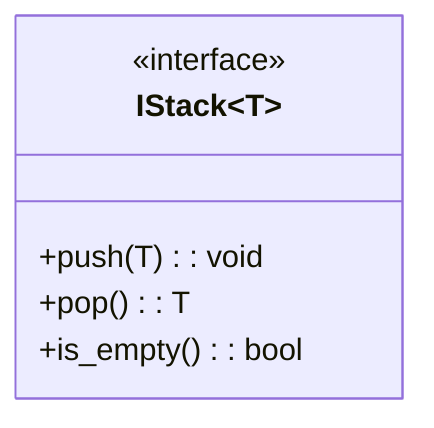
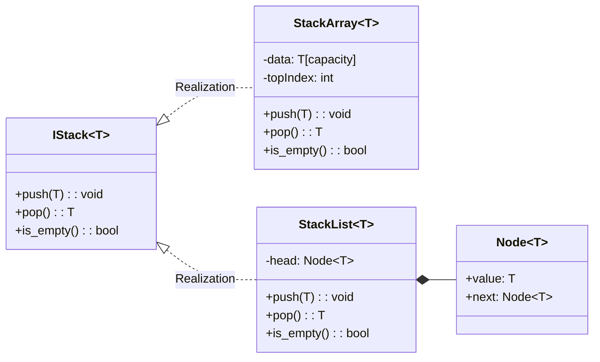
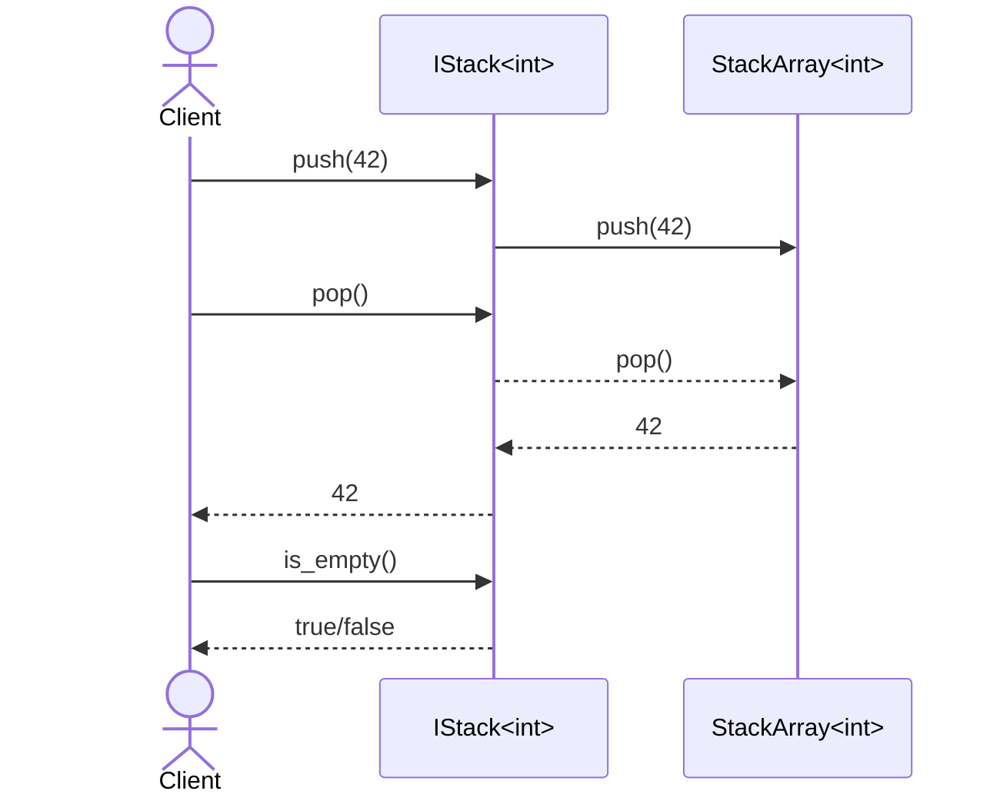

In programming, we often talk about **data structures**, like arrays, lists, stacks, queues, and so on.
But underneath them lies a deeper, more theoretical concept that defines *how* we use and reason about these structures: the **Abstract Data Type**, or **ADT**.

## 1. What is an **Abstract Data Type (ADT)**?

An **Abstract Data Type (ADT)** is a **mathematical model** that defines:

- **What** operations can be performed on a data structure.
- **What** behavior those operations guarantee, but **not** how they are implemented.

Think of it as a **contract** or a **blueprint**.

::: info ADT
Logical description of data + allowed operations.
:::

::: tip
The *“abstract”* part means we don’t care about how it’s implemented internally — only about what it can do.
:::

## 2. Everyday Analogy

Consider a **vending machine**.

- You can insert coins.
- You can select a product.
- You can get your product.

You don't need to know:

- What sensors are used.
- How the internal mechanism works.
- How it keeps track of inventory.
- How the machine counts your money.
- How it releases the drink.

::: info
You just trust the **interface**. The **what**, not the **how**.
:::

That’s exactly what an ADT is in computer science.

## 3. Formal Definition

An Abstract Data Type is defined by:

1. A **set of values** (the data it can store), and
2. A **set of operations** that can be performed on those values,
   along with rules that describe how those operations behave.

::: info Example
A **Stack ADT** is defined by:

- **Values:** an ordered collection of elements.
- **Operations:**
  - `push(x)` — adds element `x` to the top.
  - `pop()` — removes the top element.
  - `top()` — looks at the top without removing.
  - `is_empty()` — checks if the stack is empty.
:::

::: warning
Nowhere do we say *how* the stack is implemented. It could be:

- An array.
- A linked list.
- A dynamic container.
:::

::: tip
The behavior stays the same. That’s the essence of abstraction.
:::

## 4. ADT vs. Data Structure


This is a **classic confusion** — and an important one to clear up:

| Concept | Focus | Example | Description |
|----------|--------|----------|--------------|
| **Abstract Data Type (ADT)** | *What it does* | Stack, Queue, Map | Defines operations and expected behavior. |
| **Data Structure** | *How it works* | Array, Linked List, Hash Table | Concrete way to store and organize data. |

In other words:

- **ADT = concept / behavior**.
- **Data structure = implementation**.

You can implement the same ADT using different data structures.

::: tip Example
The **Stack ADT** can be implemented with:

- An **array** (fixed or dynamic size).
- A **linked list** (nodes pointing to the next element).

:::

Both support `push` and `pop` operations, but performance characteristics differ.

## 5. ADTs in Modern Programming

In modern languages, ADTs are often represented as **interfaces**, **abstract classes**, or **concepts**.



For example, in C++:

```cpp
<!-- @include: @src/_external/learn_cpp/apps/001_moderndev_sources/001_adt/include/ds/IStack.hpp -->
```

This defines a **Stack ADT**. Any class implementing this interface provides a concrete data structure that fulfills the same behavioral contract. The C++ interface is extended with additional operations, such as `emplace` and `try_pop`, to enhance usability and performance.

## 6. Example: Stack ADT Implementations



### Array-Based Stack (Fixed Capacity)

```cpp
<!-- @include: @src/_external/learn_cpp/apps/001_moderndev_sources/001_adt/include/ds/StackArray.hpp -->
```

::: details Usage Example
```cpp
<!-- @include: @src/_external/learn_cpp/apps/001_moderndev_sources/001_adt/tests/ds/StackArrayTest.cpp -->
```
:::

### Linked-List Stack

```cpp
<!-- @include: @src/_external/learn_cpp/apps/001_moderndev_sources/001_adt/include/ds/StackList.hpp -->
```

::: info
Both behave as stacks (LIFO),
but the data structures differ — and so do memory and speed trade-offs.
:::

::: details Usage Example
```cpp
<!-- @include: @src/_external/learn_cpp/apps/001_moderndev_sources/001_adt/tests/ds/StackListTest.cpp -->
```
:::


## 7. Why ADTs Matter

::: info
**Abstract Data Types** are the **bridge** between algorithms and data structures.
:::

They let us:

- Design algorithms independently of the underlying data representation.
- Write clean interfaces that can evolve without breaking the rest of the code.
- Reason about correctness and complexity mathematically.

::: info
In other words, they separate **conceptual behavior** from **implementation details**.
:::

### Using an ADT via its Interface



## 8. Common ADTs You’ll Encounter

Here’s a list of the most fundamental **ADTs** that nearly every program uses:

| ADT                  | Description                           | Common Implementations            |
| -------------------- | ------------------------------------- | --------------------------------- |
| **Stack**            | LIFO (Last In, First Out) collection  | Array, Linked List                |
| **Queue**            | FIFO (First In, First Out) collection | Circular Buffer, Linked List      |
| **Deque**            | Double-ended queue                    | Dynamic Array, Doubly Linked List |
| **List / Sequence**  | Ordered collection                    | Array, Linked List                |
| **Set**              | Unique elements, no duplicates        | Hash Table, Balanced Tree         |
| **Map / Dictionary** | Key–value pairs                       | Hash Map, Balanced Tree           |
| **Priority Queue**   | Elements with priority order          | Heap                              |
| **Graph**            | Nodes and edges connecting them       | Adjacency List, Matrix            |

::: info
Each of these defines behavior **abstractly** — you can implement them differently for different trade-offs.
:::

## 9. Abstraction, Encapsulation, and Reuse

ADTs promote:

- **Abstraction** — hiding the details of how operations are performed.
- **Encapsulation** — protecting internal state.
- **Reusability** — algorithms can work with any structure that satisfies the same interface.

That’s why most programming libraries — from the C++ STL to Python collections — are built around ADTs at their core.

## 10. Key Takeaways

::: tip

- An **Abstract Data Type (ADT)** defines what operations can be done and how they should behave, but **not how they are implemented**.
- A **Data Structure** is a specific way of implementing that **ADT**.
- **ADTs** make it possible to separate design from implementation.
- Understanding **ADTs** helps you reason about algorithms, performance, and correctness at a deeper level.

:::