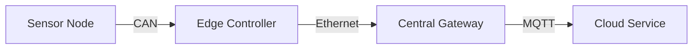

# 👨‍💻 Alex Carter — Senior C++ Software Engineer

[](https://linkedin.com/in/alexcarter)
[](https://github.com/alexcarter)
[](mailto:alex.carter@email.com)
[](https://alexcarter.dev)

> “I write C++ not just to solve problems, but to engineer systems that last.”

---

## 🧭 About Me

I'm a **Senior C++ Software Engineer** with over **10 years of experience** building high-performance software in **embedded**, **industrial automation**, and **IoT systems**. I specialize in **C++17/20**, **Boost**, and **multithreaded system design**. My code emphasizes performance, reliability, and maintainability.

---

## ⚙️ Core Competencies

| Category         | Skills                                           |
| ---------------- | ------------------------------------------------ |
| **Languages**    | C++17/20, Python, Bash, C, JavaScript            |
| **Frameworks**   | Boost.Asio, Qt, Protocol Buffers, GoogleTest     |
| **Tools**        | CMake, Conan, Docker, Git, Valgrind, perf        |
| **Environments** | Linux, Yocto, Ubuntu, WSL2, Windows              |
| **Concepts**     | OOP, RAII, Templates, Async I/O, Design Patterns |

---

## 🧩 Key Projects

### 🔹 SmartGrid Control System (2021–2024)

**Role:** Lead C++ Engineer
**Tech:** C++20, Boost.Asio, MQTT, Yocto, gtest

* Architected **distributed real-time communication** for 30+ devices using Boost.Asio.
* Designed a **message routing framework** with thread-safe queues and futures.
* Implemented custom **observer/event pattern** for live diagnostics and metrics.

```cpp
template <typename T>
class Signal {
public:
    using Slot = std::function<void(const T&)>;
    void connect(Slot slot) { slots_.push_back(std::move(slot)); }
    void emit(const T& value) { for (auto& s : slots_) s(value); }
private:
    std::vector<Slot> slots_;
};
```

> ⚡ This system handled over **2,000 messages/sec** with less than **5 ms latency**.

<details>
<summary>📊 Architecture Overview</summary>



</details>

---

### 🔹 Industrial Vision Platform (2018–2021)

**Tech:** C++17, OpenCV, Qt, Python, JSON

* Built **plugin-based image processing pipeline** using dynamic module loading.
* Integrated **AI inference engine** with C++ wrapper over TensorRT.
* Created GUI for **real-time defect visualization** and result export.

> 🧠 Achieved 30% faster image throughput using zero-copy buffer design.

---

### 🔹 Embedded Telemetry System (2016–2018)

**Tech:** C++14, CAN, Modbus, Embedded Linux

* Developed a **fault-tolerant communication layer** for field devices.
* Implemented **data compression and buffering** in memory-constrained systems.
* Added CI/CD pipeline using GitLab runners on ARM cross-compilation toolchains.

---

## 🧠 Technical Strengths

* ⚙️ Advanced C++ templates & type traits
* 🧵 Multithreading, synchronization primitives, and async architecture
* 📦 Modular system design, plugin architectures
* 🧪 Unit/integration testing & coverage analysis
* 🧰 Strong experience in cross-compilation and embedded debugging

---

## 🧰 Example Code Snippet

```cpp
auto execute_with_timeout = [](auto&& func, std::chrono::milliseconds timeout) {
    std::promise<void> done;
    auto future = done.get_future();
    std::thread([&]{ func(); done.set_value(); }).detach();
    return future.wait_for(timeout) == std::future_status::ready;
};
```

> ⏱️ Utility function to wrap any callable with a timeout guard for embedded or async tasks.

---

## 🎓 Education & Certifications

* **M.Sc. in Computer Engineering** — Warsaw University of Technology (2014)
* **Advanced C++ Programming (JetBrains)** — 2023
* **Boost and Modern Asio Workshop** — 2022

---

## 💬 Languages

| Language | Proficiency       |
| -------- | ----------------- |
| English  | C1 (Advanced)     |
| Polish   | Native            |
| German   | B1 (Intermediate) |

---

## 🧭 Professional Philosophy

> "Great software is not written once — it's **designed** to evolve gracefully."

---

## 📫 Contact

📧 **Email:** [alex.carter@email.com](mailto:alex.carter@email.com)
💼 **LinkedIn:** [linkedin.com/in/alexcarter](https://linkedin.com/in/alexcarter)
🌐 **Portfolio:** [alexcarter.dev](https://alexcarter.dev)

---

> 🏁 *Last updated:* October 2025
> Licensed under [CC BY-NC 4.0](https://creativecommons.org/licenses/by-nc/4.0/)
